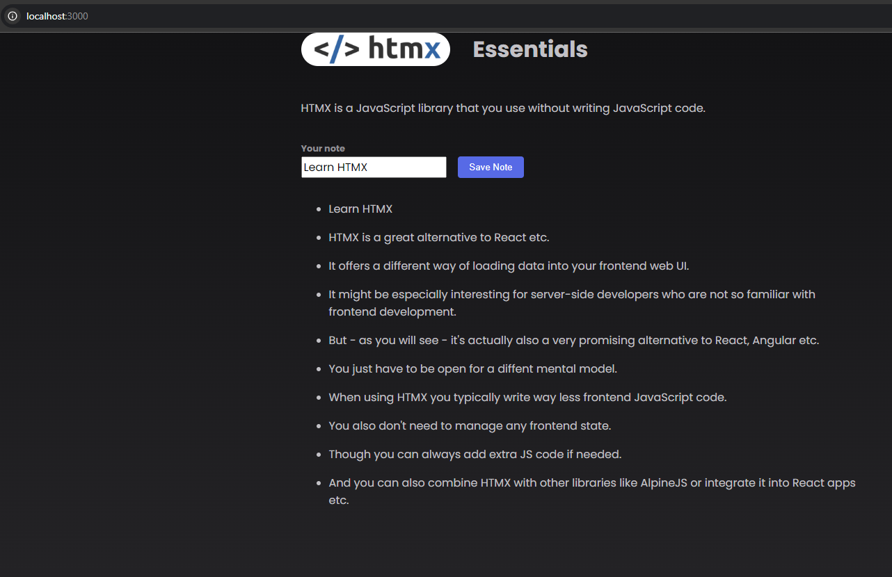
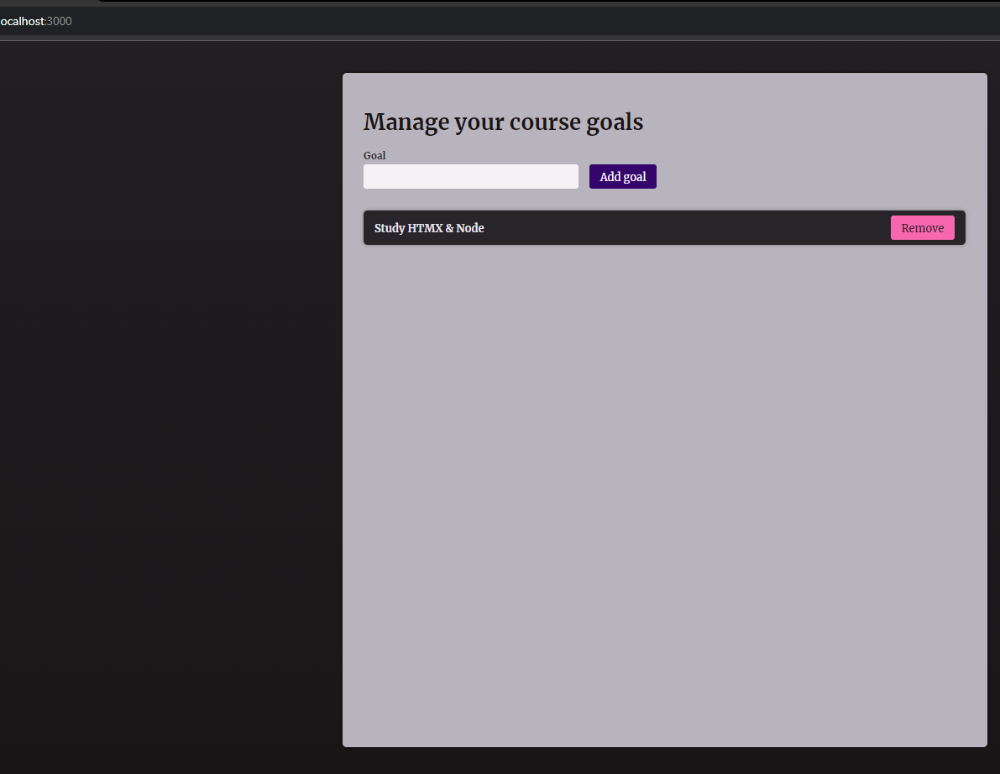
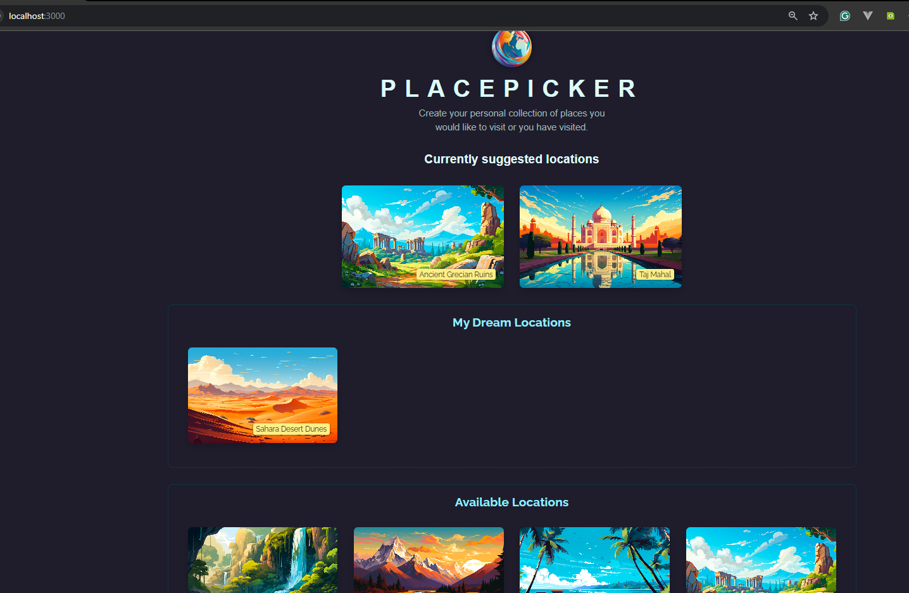
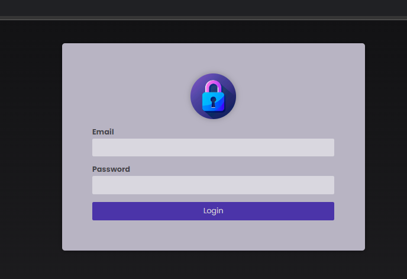

## Repo for learning NextJS + HTMX.

### This repo contains some projects, written with HTMX & NodeJS.

- They were built by following [this course](https://www.udemy.com/course/htmx-the-practical-guide/)

# 1. Todo App.

# 2. Another Todo App.

# 3. Places to travel picker.

# 4. Authentication screen using HTMX.

# 5. Small SPA shop.
